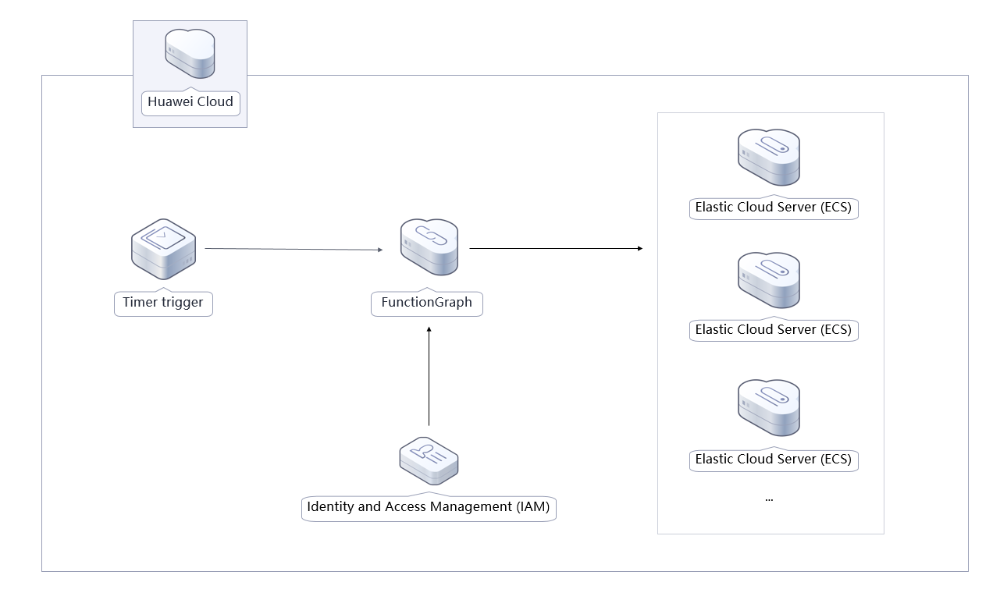
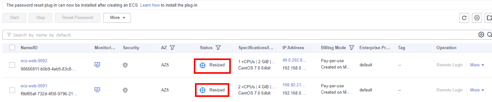
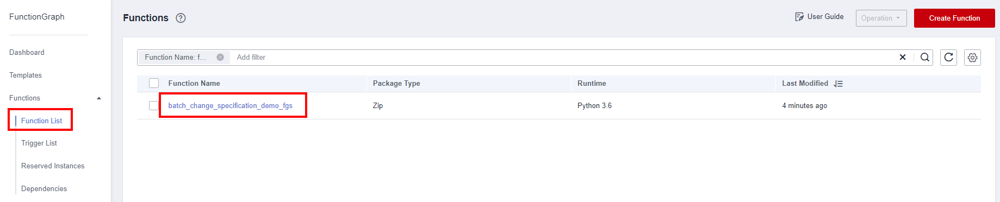
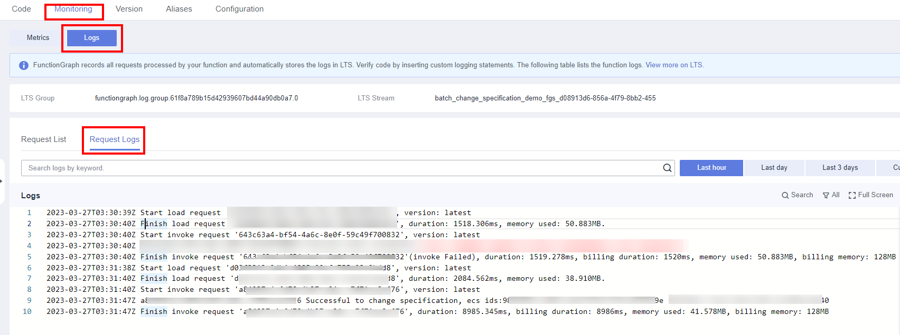

[TOC]

**Solution Overview**
===============
This solution uses a FunctionGraph timer trigger to periodically modify Elastic Cloud Server (ECS) specifications. You can schedule an upgrade for more requests (for example, seckills) or a downgrade for fewer requests, instead of manually modifying the specifications of each server.

For more details about this solution, visit:https://www.huaweicloud.com/intl/en-us/solution/implementations/secsm.html

**Architecture**
---------------


**Architecture Description**
---------------
This solution will:

1. Create a FunctionGraph function to call the ECS API used to modify specifications.

2. Create the required function dependency with the Python SDK of ECS.

3. Create a timer to periodically invoke the function code.

4. Create an agency in Identity and Access Management (IAM) to delegate FunctionGraph to access ECS in the relevant region.

**File Structure**
---------------

``` lua
huaweicloud-solution-scheduled-changing-instances-specifications
├── scheduled-changing-instances-specifications.tf.json -- Resource orchestration template
├── functiongraph
    ├── batch_change_specification_at_scheduled_time.py  -- Function file
```
**Getting Started**
---------------
1. Log in to the [Elastic Cloud Server(ECS) console](https://console-intl.huaweicloud.com/ecm/?agencyId=f9a6de0674e84d4686ff806fc4eb78e8&region=ap-southeast-3&locale=en-us#/ecs/manager/vmList), view the ECS list, and check the scheduled ECS specification modification.

	Figure1 ECS specifications modified

	

2. Find the scheduling function in [FunctionGraph](https://console-intl.huaweicloud.com/functiongraph/?agencyId=f9a6de0674e84d4686ff806fc4eb78e8&region=ap-southeast-3&locale=en-us#/serverless/functionList) and click the function name.

	Figure2 View the scheduling function

	

	Figure3 Viewing the specification modification log

	

